# MVP Engenharia de Dados: Micro e Minigeração Distribuída na Região Sul

**Aluno:** Emanuel Sidoski

**Curso:** Pós-graduação em Ciência de Dados e Analytics, PUC-Rio (sprint de Engenharia de Dados)

**Repositório:** https://github.com/emanuelsid32/mvp_mmgd

---

## Contexto de Negócio e Perguntas

### Problema

Uma empresa do setor de eficiência energética precisa decidir onde e para
quem priorizar sua expansão comercial em geração distribuída, e entender
quais escolhas técnicas caracterizam o mercado atual de MMGD (micro e
minigeração distribuída).

### Perguntas de negócio

**Bloco A: Mercado e geografia**
1. Como evoluiu a potência instalada e o número de conexões de MMGD ao longo
   do tempo?
2. Quais estados da Região Sul (PR, SC, RS) e municípios concentram maior
   potência instalada, e qual o porte médio (kW por conexão) em cada um?
3. Como as conexões se distribuem entre distribuidoras?

**Bloco B: Perfil do adotante**
4. Quais classes de consumo (residencial, comercial, rural, industrial) mais
   adotam MMGD? Qual a proporção entre micro e minigeração?
5. Qual a participação de cada modalidade de geração (autoconsumo local,
   autoconsumo remoto, geração compartilhada, múltiplas UCs)?

**Bloco C: Técnico**
6. Quais fabricantes de módulos e inversores fotovoltaicos dominam o mercado?
7. Qual o fator de dimensionamento médio (potência CC dos módulos ÷ potência
   CA dos inversores) dos sistemas fotovoltaicos instalados?

### Fontes de dados e licença

Os dados são do **Portal de Dados Abertos da ANEEL**
(dadosabertos.aneel.gov.br), publicados sob a licença **ODbL (Open
Database License)**, que permite uso livre com citação da fonte.

Foram usados dois arquivos CSV:

1. **Relação de Empreendimentos de Geração Distribuída**
   (`empreendimento-geracao-distribuida.csv`, 1,42 GB): cadastro de todos
   os empreendimentos de MMGD conectados no Brasil.
   URL: https://dadosabertos.aneel.gov.br/dataset/5e0fafd2-21b9-4d5b-b622-40438d40aba2/resource/b1bd71e7-d0ad-4214-9053-cbd58e9564a7/download/empreendimento-geracao-distribuida.csv

2. **Informações Técnicas: Geração Distribuída Fotovoltaica**
   (`empreendimento-gd-informacoes-tecnicas-fotovoltaica.csv`, 607 MB):
   dados técnicos dos sistemas fotovoltaicos.
   URL: https://dadosabertos.aneel.gov.br/dataset/5e0fafd2-21b9-4d5b-b622-40438d40aba2/resource/49fa9ca0-f609-4ae3-a6f7-b97bd0945a3a/download/empreendimento-gd-informacoes-tecnicas-fotovoltaica.csv

### Estrutura dos dados brutos

Principais colunas de cada arquivo usadas no projeto:

**empreendimento-geracao-distribuida.csv** (um registro por empreendimento)

| Coluna | Conteúdo |
|---|---|
| CodEmpreendimento | Código do empreendimento na ANEEL |
| SigAgente, NomAgente, NumCNPJDistribuidora | Distribuidora responsável |
| CodClasseConsumo, DscClasseConsumo | Classe de consumo (residencial, comercial etc.) |
| CodSubGrupoTarifario, DscSubGrupoTarifario | Subgrupo tarifário |
| CodMunicipioIbge, NomMunicipio, SigUF, NomRegiao, CodRegiao | Localização |
| DthAtualizaCadastralEmpreend | Data de referência do empreendimento, usada como data de conexão |
| SigModalidadeEmpreendimento, DscModalidadeHabilitado | Modalidade de compensação |
| QtdUCRecebeCredito | Unidades consumidoras que recebem os créditos |
| SigTipoGeracao, DscFonteGeracao, DscPorte | Fonte de geração e porte (micro ou mini) |
| MdaPotenciaInstaladaKW | Potência instalada (kW) |

**empreendimento-gd-informacoes-tecnicas-fotovoltaica.csv** (um registro por sistema fotovoltaico)

| Coluna | Conteúdo |
|---|---|
| CodGeracaoDistribuida | Código do empreendimento (mesmo valor de CodEmpreendimento) |
| NomFabricanteModulo, NomFabricanteInversor | Fabricantes (texto livre) |
| QtdModulos | Quantidade de módulos |
| MdaAreaArranjo | Área do arranjo (m²) |
| MdaPotenciaInstalada, MdaPotenciaModulos, MdaPotenciaInversores | Potências (kW) |
| DatConexao | Data de conexão |

### Decisão de escopo: Região Sul (PR, SC, RS)

Os dois arquivos somam mais de 2 GB, volume pesado para o ambiente
gratuito do Databricks. Por isso recortei os dados para a Região Sul já na
camada Bronze. Além de deixar o volume tratável, as perguntas sobre
concentração geográfica ficam mais úteis comparando três estados da mesma
região do que diluídas em 27 UFs. O recorte só limita quais linhas entram
no pipeline, sem alterar nenhum valor, e pode ser refeito a partir dos
mesmos arquivos da ANEEL.

---

## Carga dos Dados (Etapa 4.2)

Os dois arquivos foram baixados do portal da ANEEL e enviados por upload
para um **Volume** do Unity Catalog (`mvp_mmgd.bronze.raw`), pela interface
do Databricks. O notebook `01_ingestao_bronze` lê os arquivos do Volume e
grava as tabelas Bronze.

A leitura usa separador `;` e codificação UTF-8. Testei antes ISO-8859-1,
comum em dados públicos brasileiros, mas ela corrompia os acentos.

Na carga foi aplicado o filtro da Região Sul pela coluna `SigUF`:

| Métrica | Valor |
|---|---|
| Empreendimentos no Brasil | 4.624.379 |
| Empreendimentos na Região Sul | 966.881 |
| Percentual mantido | 20,9% |

A tabela técnica não tem coluna de UF, então o mesmo recorte foi aplicado
com um *semi-join* pelo código do empreendimento. Resultado: 966.605
registros técnicos. A diferença de 276 é esperada, porque a tabela
técnica só cobre sistemas fotovoltaicos, e o cadastro principal inclui
também eólica, hidráulica e térmica.

Tabelas Bronze gravadas em formato Delta (`mvp_mmgd.bronze`):
`empreendimento_gd`, `tecnica_fotovoltaica` e `_log_ingestao` (histórico
de cada carga). As duas primeiras levam colunas de linhagem
(`_dth_ingestao`, `_arquivo_origem`, `_camada`) e têm descrição registrada
no Unity Catalog.

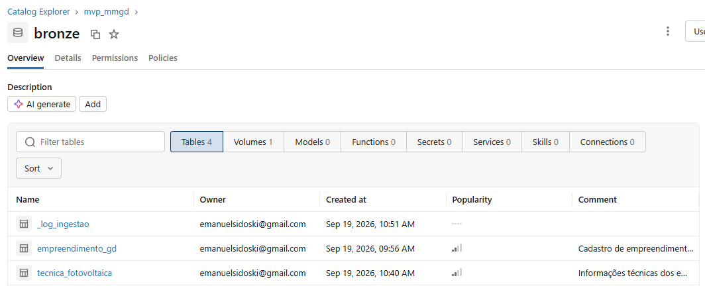

---

## Modelagem e Catálogo de Dados (Etapa 4.3)

### Modelo adotado

A camada Gold segue um **esquema constelação**: duas tabelas fato que
compartilham o código do empreendimento, cercadas por dimensões.

- `f_conexao_mmgd`: um registro por empreendimento. Ligada a `d_tempo`,
  `d_distribuidora`, `d_localidade`, `d_classificacao_consumo`,
  `d_modalidade` e `d_fonte`.
- `f_tecnica_fv`: um registro por sistema fotovoltaico. Ligada duas vezes
  à `d_fabricante` (módulo e inversor) e à `f_conexao_mmgd` pelo
  `cod_empreendimento`.

```
                d_tempo   d_distribuidora   d_localidade
                     \          |           /
d_classificacao_consumo -- f_conexao_mmgd -- d_modalidade
                                |         \
                                |          d_fonte
                        cod_empreendimento
                                |
       d_fabricante (módulo) -- f_tecnica_fv -- d_fabricante (inversor)
```

Algumas escolhas do modelo:

- **Surrogate keys** geradas com `monotonically_increasing_id()`. A
  exceção é `d_tempo`, que usa a própria data no formato `yyyyMMdd`.
- **Membro desconhecido** em `d_tempo` (`sk_tempo = -1`) para os
  registros com data inválida, em vez de excluí-los.
- **Dimensão de papéis:** a mesma `d_fabricante` serve para módulo e
  inversor.
- **Dimensão degenerada:** o `cod_empreendimento` fica na própria fato,
  sem tabela de dimensão, e liga as duas fatos.

Tabelas persistidas e documentadas no Unity Catalog:

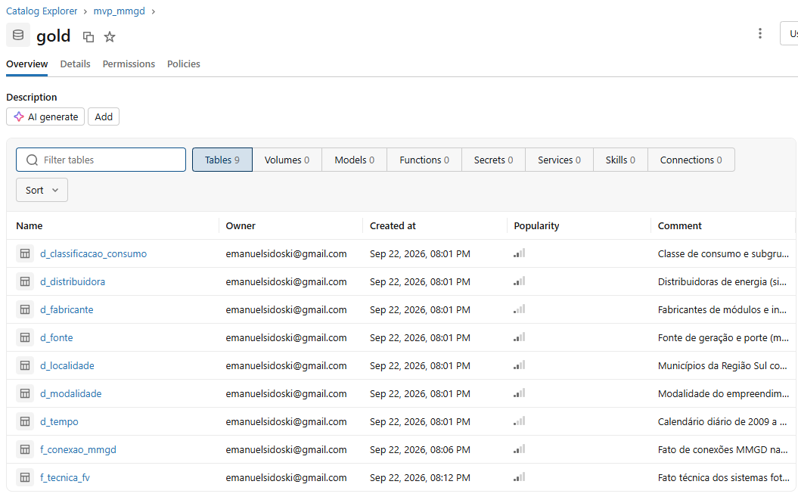

### Catálogo de dados

Todas as tabelas da Gold também possuem as colunas de linhagem `_camada`
(texto, sempre `gold`) e `_dth_carga` (timestamp da gravação), omitidas
abaixo para não repetir. Origem Silver: `mvp_mmgd.silver.empreendimento_gd`
(abreviada como *emp*) e `mvp_mmgd.silver.tecnica_fotovoltaica` (*tec*).

#### f_conexao_mmgd
Fato de conexões MMGD na Região Sul. Grão: um empreendimento. 966.881 linhas.

| Coluna | Tipo | Descrição | Domínio | Origem |
|---|---|---|---|---|
| cod_empreendimento | texto | Código do empreendimento na ANEEL (dimensão degenerada) | Formato `GD.UF.nnn.nnn.nnn` | emp.CodEmpreendimento |
| sk_tempo | inteiro | Chave da data de conexão | `yyyyMMdd` ou -1 (data desconhecida) | Derivada de emp.DthAtualizaCadastralEmpreend |
| sk_distribuidora | inteiro longo | Chave da distribuidora | Chaves de `d_distribuidora` | Join com `d_distribuidora` |
| sk_localidade | inteiro longo | Chave do município | Chaves de `d_localidade` | Join com `d_localidade` |
| sk_classificacao_consumo | inteiro longo | Chave da classe de consumo | Chaves de `d_classificacao_consumo` | Join com `d_classificacao_consumo` |
| sk_modalidade | inteiro longo | Chave da modalidade | Chaves de `d_modalidade` | Join com `d_modalidade` |
| sk_fonte | inteiro longo | Chave da fonte e porte | Chaves de `d_fonte` | Join com `d_fonte` |
| potencia_instalada_kw | decimal | Potência instalada do empreendimento (kW) | 0 a 5.000 | emp.MdaPotenciaInstaladaKW (vírgula convertida para ponto) |
| qtd_uc_recebe_credito | inteiro | Unidades consumidoras que recebem os créditos | 1 a 3.707 | emp.QtdUCRecebeCredito |

#### f_tecnica_fv
Fato técnica dos sistemas fotovoltaicos. Grão: um sistema. 966.605 linhas.

| Coluna | Tipo | Descrição | Domínio | Origem |
|---|---|---|---|---|
| cod_empreendimento | texto | Código do empreendimento, liga com `f_conexao_mmgd` | Formato `GD.UF.nnn.nnn.nnn` | tec.CodGeracaoDistribuida |
| sk_fabricante_modulo | inteiro longo | Chave do fabricante dos módulos | Chaves de `d_fabricante`; nulo se não informado | Join com `d_fabricante` |
| sk_fabricante_inversor | inteiro longo | Chave do fabricante dos inversores | Chaves de `d_fabricante`; nulo se não informado | Join com `d_fabricante` |
| qtd_modulos | inteiro | Quantidade de módulos | 0 a 800.000 (*) | tec.QtdModulos |
| area_arranjo | decimal | Área do arranjo fotovoltaico (m²) | 0 a 977.177 (*) | tec.MdaAreaArranjo |
| potencia_modulos_kw | decimal | Potência total dos módulos, lado CC (kW) | 0 a 9.920 (*) | tec.MdaPotenciaModulos |
| potencia_inversores_kw | decimal | Potência total dos inversores, lado CA (kW) | 0 a 9.600 (*) | tec.MdaPotenciaInversores |
| fator_dimensionamento | decimal | Relação potência CC / CA | 0 a 8.636 (*), mediana 1,10; nulo se inversor = 0 | Calculado: potencia_modulos_kw / potencia_inversores_kw |

(*) Os máximos são erros da origem, tratados na análise. Ver Qualidade de Dados.

#### d_tempo
Calendário diário. 6.284 linhas (6.283 dias + membro desconhecido).

| Coluna | Tipo | Descrição | Domínio | Origem |
|---|---|---|---|---|
| sk_tempo | inteiro | Chave da data | `yyyyMMdd`; -1 = data desconhecida | Gerada |
| data | data | Dia do calendário | 2009-06-19 a 2026-08-31; nulo no membro -1 | Gerada a partir do intervalo de emp.DthAtualizaCadastralEmpreend |
| ano | inteiro | Ano | 2009 a 2026 | Derivada de `data` |
| mes | inteiro | Mês | 1 a 12 | Derivada de `data` |
| nome_mes | texto | Nome do mês | Nomes dos meses; "Desconhecida" no membro -1 | Derivada de `data` |
| trimestre | inteiro | Trimestre | 1 a 4 | Derivada de `data` |
| dia | inteiro | Dia do mês | 1 a 31 | Derivada de `data` |
| flag_pos_lei_14300 | booleano | Data a partir da Lei 14.300 (06/01/2022) | true / false | Derivada de `data` |

#### d_distribuidora
Distribuidoras de energia. 67 linhas.

| Coluna | Tipo | Descrição | Domínio | Origem |
|---|---|---|---|---|
| sk_distribuidora | inteiro longo | Chave da distribuidora | Gerada | `monotonically_increasing_id()` |
| SigAgente | texto | Sigla da distribuidora | 67 valores | emp.SigAgente |
| NomAgente | texto | Nome da distribuidora | 67 valores | emp.NomAgente |
| NumCNPJDistribuidora | texto | CNPJ da distribuidora | 14 dígitos | emp.NumCNPJDistribuidora |

#### d_localidade
Municípios da Região Sul. 1.191 linhas.

| Coluna | Tipo | Descrição | Domínio | Origem |
|---|---|---|---|---|
| sk_localidade | inteiro longo | Chave do município | Gerada | `monotonically_increasing_id()` |
| CodMunicipioIbge | inteiro | Código IBGE do município | 7 dígitos, iniciando em 41 (PR), 42 (SC) ou 43 (RS) | emp.CodMunicipioIbge |
| NomMunicipio | texto | Nome do município | 1.191 municípios | emp.NomMunicipio |
| SigUF | texto | Estado | PR, SC, RS | emp.SigUF |
| NomRegiao | texto | Região | Sul | emp.NomRegiao |
| CodRegiao | inteiro | Código da região | Código da Região Sul | emp.CodRegiao |

#### d_classificacao_consumo
Classe de consumo e subgrupo tarifário. 63 linhas.

| Coluna | Tipo | Descrição | Domínio | Origem |
|---|---|---|---|---|
| sk_classificacao_consumo | inteiro longo | Chave | Gerada | `monotonically_increasing_id()` |
| CodClasseConsumo | inteiro | Código da classe | Códigos ANEEL | emp.CodClasseConsumo |
| DscClasseConsumo | texto | Classe de consumo | Residencial, Comercial, Industrial, Rural, Poder Público, Serviço Público, Iluminação pública, Consumo Próprio, REBR | emp.DscClasseConsumo |
| DscSubGrupoTarifario | texto | Subgrupo tarifário | Subgrupos dos grupos A e B | emp.DscSubGrupoTarifario |

#### d_modalidade
Modalidade do empreendimento. 5 linhas.

| Coluna | Tipo | Descrição | Domínio | Origem |
|---|---|---|---|---|
| sk_modalidade | inteiro longo | Chave | Gerada | `monotonically_increasing_id()` |
| DscModalidadeHabilitado | texto | Modalidade de compensação | Geracao na propria UC, Auto consumo remoto, Compartilhada, Condomínio, nulo (não informado) | emp.DscModalidadeHabilitado |

#### d_fonte
Fonte de geração e porte. 24 linhas.

| Coluna | Tipo | Descrição | Domínio | Origem |
|---|---|---|---|---|
| sk_fonte | inteiro longo | Chave | Gerada | `monotonically_increasing_id()` |
| SigTipoGeracao | texto | Tipo de usina | UFV (solar), EOL (eólica), CGH (hidráulica), UTE (térmica), nulo | emp.SigTipoGeracao |
| DscFonteGeracao | texto | Fonte de energia | Radiação solar, Cinética do vento, Potencial hidráulico, biomassas, biogás, gás natural etc.; nulo | emp.DscFonteGeracao |
| DscPorte | texto | Porte | Microgeracao (até 75 kW), Minigeracao (acima de 75 kW) | emp.DscPorte |

#### d_fabricante
Fabricantes de módulos e inversores. 25.736 linhas. Usada duas vezes pela `f_tecnica_fv` (dimensão de papéis).

| Coluna | Tipo | Descrição | Domínio | Origem |
|---|---|---|---|---|
| sk_fabricante | inteiro longo | Chave | Gerada | `monotonically_increasing_id()` |
| nome_fabricante | texto | Nome do fabricante como informado | 25.736 valores (texto livre) | União de tec.NomFabricanteModulo e tec.NomFabricanteInversor |
| grupo_fabricante | texto | Agrupamento para análise | 50 maiores fabricantes + OUTROS | Derivada da frequência de `nome_fabricante` |

---

## Pipeline de Dados (Etapa 4.4)

O pipeline segue a arquitetura medalhão (Bronze, Silver e Gold), com um
notebook por camada na pasta `mvp_mmgd` do Databricks. Cada notebook lê as
tabelas gravadas pelo anterior (`spark.table(...)`), e só o primeiro lê o
CSV. Os notebooks estão neste repositório:

| Notebook | O que faz |
|---|---|
| `01_ingestao_bronze` | Lê os CSVs do Volume, aplica o recorte da Região Sul e grava a Bronze |
| `02_transformacao_silver` | Corrige tipos e formatos, padroniza fabricantes e grava a Silver |
| `03_modelagem_gold` | Monta as dimensões e as fatos e grava a Gold |
| `04_analise` | Consultas SQL que respondem às perguntas de negócio |

**Silver.** Principais transformações:
- troca da vírgula decimal por ponto e conversão para número em 5 colunas
  de medida (`MdaPotenciaInstaladaKW`, `MdaAreaArranjo`,
  `MdaPotenciaInstalada`, `MdaPotenciaModulos`, `MdaPotenciaInversores`);
- padronização dos nomes de fabricante (espaços, maiúsculas, textos como
  "NÃO HÁ" tratados como nulo e sinônimos mais comuns unificados);
- conversão de `QtdModulos` e `DatConexao` com `try_cast`/`try_to_date`,
  que devolvem nulo em vez de erro nos poucos valores corrompidos;
- verificação de duplicidade de `CodEmpreendimento` e
  `CodGeracaoDistribuida` (nenhuma encontrada);
- gravação em `mvp_mmgd.silver` com colunas de linhagem.

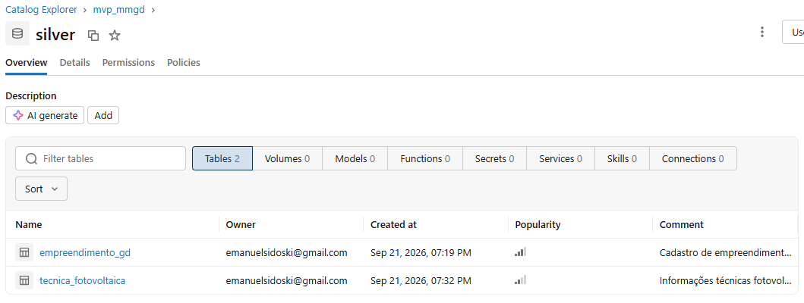

**Gold.** Primeiro foram montadas e gravadas as 7 dimensões. A ordem
importa: o `monotonically_increasing_id()` pode gerar chaves diferentes a
cada execução, então as fatos foram montadas lendo as dimensões já
gravadas, garantindo que as chaves batam.

| Tabela | Linhas |
|---|---|
| d_tempo | 6.284 (6.283 dias + membro desconhecido) |
| d_distribuidora | 67 |
| d_localidade | 1.191 |
| d_classificacao_consumo | 63 |
| d_modalidade | 5 |
| d_fonte | 24 |
| d_fabricante | 25.736 |
| f_conexao_mmgd | 966.881 |
| f_tecnica_fv | 966.605 |

Na `f_conexao_mmgd`, os textos da Silver foram trocados pelas chaves das
dimensões com *left join*. Como `d_fonte` e `d_modalidade` têm categorias
nulas legítimas ("não informado"), os joins usam `eqNullSafe`, já que num
join comum nulo não é igual a nulo. Conferências feitas: 966.881 linhas
(nenhuma perdida ou duplicada), nenhuma chave nula e 23 registros no
membro desconhecido de tempo.

Na `f_tecnica_fv`, a `d_fabricante` é ligada duas vezes (módulo e
inversor), e a chave fica nula quando o fabricante não foi informado. O
fator de dimensionamento é calculado com `try_divide`, que evita erro
quando a potência do inversor é zero.

Todas as tabelas Gold têm as colunas de linhagem `_camada` e `_dth_carga`
e descrição registrada com `COMMENT ON TABLE`.

---

## Qualidade de Dados (Etapa 4.5)

Os atributos foram verificados quanto a tipo, nulos, duplicidade,
coerência e valores extremos. Os problemas encontrados e o tratamento de
cada um:

| Problema | Onde | Tratamento |
|---|---|---|
| Vírgula como separador decimal fez as colunas de potência e área serem lidas como texto | 5 colunas de medida | Corrigido na Silver (troca por ponto e conversão para número). Na Bronze o dado ficou como veio |
| `QtdModulos` e `DatConexao` lidos como texto | tabela técnica | Conversão com `try_cast`/`try_to_date`. 38 datas (0,004%) eram números, provável deslocamento de colunas no CSV, e viraram nulo. `QtdModulos` não teve valor inválido na Região Sul |
| Data sentinela `1900-01-01` em 23 registros (0,002%) | DthAtualizaCadastralEmpreend | Apontados para o membro desconhecido de `d_tempo` (`sk_tempo = -1`) |
| Colunas 100% nulas (966.881 de 966.881) | CodSubGrupoTarifario, SigModalidadeEmpreendimento | Excluídas das dimensões. Mantidas as versões em texto, que têm dado |
| Categorias nulas legítimas | d_fonte, d_modalidade | Mantidas como "não informado", com join `eqNullSafe` |
| Distribuidoras de outros estados (EQUATORIAL GO, ENEL CE) em municípios do RS: 35 registros (0,004%) | SigAgente | Mantido como veio. Provável efeito da compra da CEEE-D pela Equatorial em 2021 ou erro de cadastro |
| UF do código do empreendimento diferente da `SigUF` em 56 registros (0,006%) | CodEmpreendimento | Considerada a `SigUF`, já confirmada pelo código IBGE. O código é só identificador |
| "REBR" duplicado por espaço sobrando | DscClasseConsumo | `TRIM` na consulta da pergunta 4 |
| Valores técnicos impossíveis (até 800.000 módulos, 977.177 m², 9.920 kW de módulos, sendo o limite da minigeração 5.000 kW) | tabela técnica | Mantidos na fato e filtrados na análise que depende deles |
| Fator de dimensionamento com média 2,09 e máximo 8.636 (mediana 1,10), e 85 sistemas sem fator por inversor zerado ou ausente | f_tecnica_fv | Na pergunta 7, uso da mediana e filtro de 0,5 a 3,0, que deixou de fora 56.441 sistemas (5,8%) |
| Nomes de fabricante em texto livre | NomFabricanteModulo, NomFabricanteInversor | Ver abaixo |

**Fabricantes.** Foi o problema mais trabalhoso. O campo é texto livre e
tem três tipos de erro: textos que significam "sem informação" ("NÃO
HÁ", "NÃO CONSTA"), que viraram nulo; grafias diferentes do mesmo
fabricante ("CANADIAN", "CANADIN SOLAR INC."), das quais os casos mais
comuns foram unificados na Silver; e campos com mais de um fabricante
("CANADIAN SOLAR ;GCL"), que ficaram como estão.

Mesmo assim sobraram 25.736 nomes diferentes. Uma análise de concentração
mostrou que 89% deles aparecem no máximo 5 vezes e que os 50 mais
frequentes cobrem 81,5% dos registros. Um exemplo claro é "RISEN", com
39.778 registros, contra "RISAN", com 1. Em vez de tentar corrigir tudo
por similaridade de texto, o que poderia juntar fabricantes diferentes,
criei o campo `grupo_fabricante`: o nome para os 50 maiores e "OUTROS"
para o resto. A limitação é que o OUTROS mistura fabricantes pequenos com
grafias variantes de grandes (a LONGi, por exemplo, ficou em OUTROS), e
aparecem até códigos de modelo digitados no lugar do fabricante. Por isso
as participações da pergunta 6 são um valor mínimo.

---

## Análise de Dados (Etapa 4.5)

As análises foram feitas em SQL no notebook `04_analise`, consultando só
as tabelas Gold.

### Pergunta 1: Como evoluiu a potência instalada e o número de conexões ao longo do tempo?

```sql
SELECT t.ano,
       COUNT(*) AS qtd_conexoes,
       ROUND(SUM(f.potencia_instalada_kw) / 1000, 1) AS potencia_mw
FROM mvp_mmgd.gold.f_conexao_mmgd f
JOIN mvp_mmgd.gold.d_tempo t ON f.sk_tempo = t.sk_tempo
WHERE t.sk_tempo <> -1
GROUP BY t.ano
ORDER BY t.ano
```

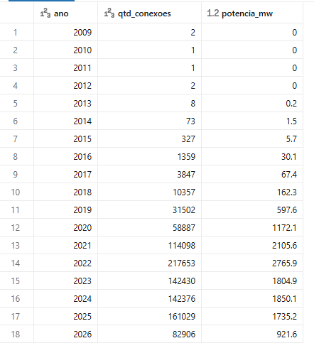
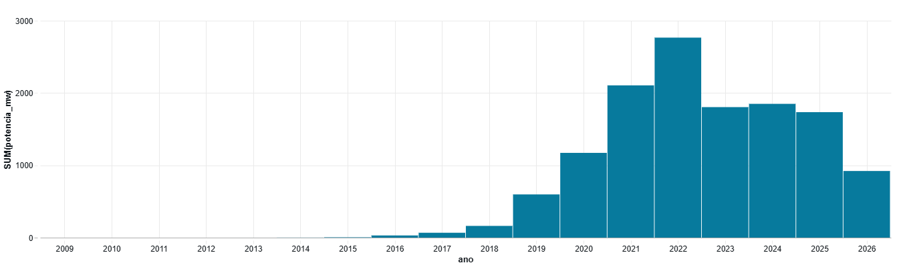

A Região Sul soma cerca de 13,2 GW de MMGD. Até 2015 o mercado era
praticamente inexistente, e de 2016 a 2021 a potência instalada por ano
praticamente dobrou a cada ano. O pico foi em 2022, com 217.653 conexões e
2.766 MW. Isso coincide com a Lei 14.300/2022, que garantiu as regras
antigas de compensação até 2045 para quem pedisse conexão até janeiro de
2023, o que gerou uma corrida. Depois o mercado se estabilizou entre 1,7 e
1,9 GW por ano. Cerca de 69% de toda a potência da região entrou de 2022
em diante.

O porte médio caiu de cerca de 19 kW por conexão (2019-2020) para 11 a 13
kW a partir de 2022, sinal de que a geração distribuída chegou a
consumidores menores. 2026 tem dados só até agosto. Projetando para o ano
todo, seriam cerca de 1,4 GW, o que pode indicar desaceleração, mas é uma
projeção simples.

### Pergunta 2: Quais estados e municípios concentram maior potência instalada, e qual o porte médio em cada um?

```sql
-- por estado (a consulta de municípios agrupa também por NomMunicipio, com LIMIT 10)
SELECT l.SigUF,
       COUNT(*) AS qtd_conexoes,
       ROUND(SUM(f.potencia_instalada_kw) / 1000, 1) AS potencia_mw,
       ROUND(AVG(f.potencia_instalada_kw), 1) AS kw_por_conexao
FROM mvp_mmgd.gold.f_conexao_mmgd f
JOIN mvp_mmgd.gold.d_localidade l ON f.sk_localidade = l.sk_localidade
GROUP BY l.SigUF
ORDER BY potencia_mw DESC
```

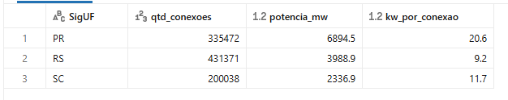
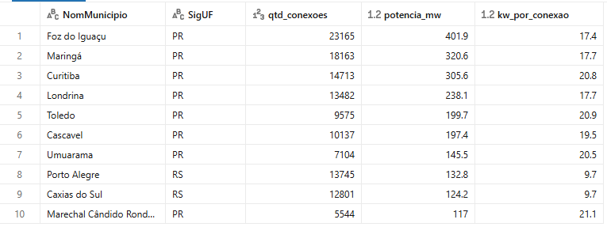

| UF | % das conexões | % da potência | kW por conexão |
|---|---|---|---|
| PR | 34,7% | 52,2% | 20,6 |
| RS | 44,6% | 30,2% | 9,2 |
| SC | 20,7% | 17,7% | 11,7 |

O Paraná tem mais da metade da potência da região, mesmo com menos
conexões que o Rio Grande do Sul. A diferença está no porte: 20,6 kW por
conexão no PR, contra 9,2 kW no RS, que tem muitos sistemas pequenos.

Entre os municípios, 8 dos 10 maiores são do interior do Paraná, nas
regiões Oeste e Norte (Foz do Iguaçu, Maringá, Londrina, Toledo,
Cascavel, Umuarama e Marechal Cândido Rondon), com 17 a 21 kW por
conexão. Porto Alegre e Caxias do Sul aparecem com menos de 10 kW. Mesmo
assim, os 10 maiores somam só 16,5% da potência total. Vale lembrar que o
município registrado é o da usina, que no autoconsumo remoto pode ser
diferente do município do consumidor (pergunta 5).

### Pergunta 3: Como as conexões se distribuem entre distribuidoras?

```sql
SELECT d.SigAgente,
       COUNT(*) AS qtd_conexoes,
       ROUND(SUM(f.potencia_instalada_kw) / 1000, 1) AS potencia_mw,
       ROUND(COUNT(*) * 100.0 / SUM(COUNT(*)) OVER (), 1) AS pct_conexoes
FROM mvp_mmgd.gold.f_conexao_mmgd f
JOIN mvp_mmgd.gold.d_distribuidora d ON f.sk_distribuidora = d.sk_distribuidora
GROUP BY d.SigAgente
ORDER BY qtd_conexoes DESC
LIMIT 15
```

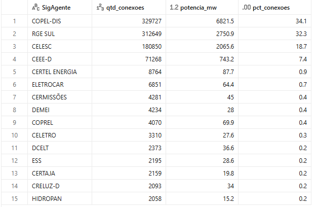

Das 67 distribuidoras, quatro concentram 92,5% das conexões e 93,7% da
potência: COPEL-DIS (PR), RGE SUL (RS), CELESC (SC) e CEEE-D (RS). Só a
COPEL tem 34,1% das conexões e 51,6% da potência. As outras 63, na maioria
cooperativas de eletrificação rural do RS, somam cerca de 7,5% das
conexões. Na prática, conhecer bem os processos de conexão de quatro
distribuidoras já cobre mais de 90% do mercado da região.

### Pergunta 4: Quais classes de consumo mais adotam MMGD? Qual a proporção entre micro e minigeração?

```sql
-- por classe (a consulta de porte usa a mesma estrutura, agrupando por d_fonte.DscPorte)
SELECT TRIM(c.DscClasseConsumo) AS classe,
       COUNT(*) AS qtd_conexoes,
       ROUND(COUNT(*) * 100.0 / SUM(COUNT(*)) OVER (), 1) AS pct_conexoes,
       ROUND(SUM(f.potencia_instalada_kw) / 1000, 1) AS potencia_mw,
       ROUND(SUM(f.potencia_instalada_kw) * 100.0 / SUM(SUM(f.potencia_instalada_kw)) OVER (), 1) AS pct_potencia,
       ROUND(AVG(f.potencia_instalada_kw), 1) AS kw_por_conexao
FROM mvp_mmgd.gold.f_conexao_mmgd f
JOIN mvp_mmgd.gold.d_classificacao_consumo c ON f.sk_classificacao_consumo = c.sk_classificacao_consumo
GROUP BY TRIM(c.DscClasseConsumo)
ORDER BY qtd_conexoes DESC
```

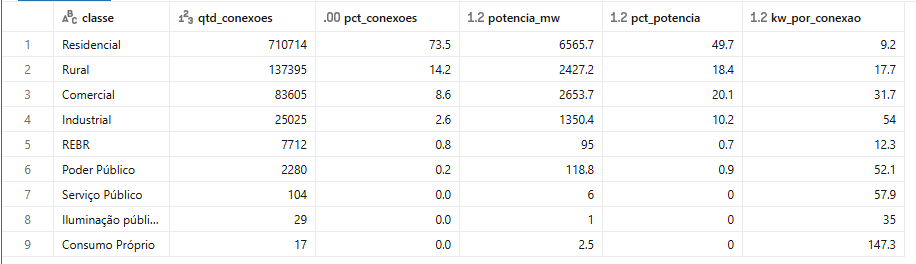
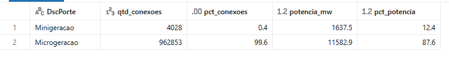

| Classe | % conexões | % potência | kW por conexão |
|---|---|---|---|
| Residencial | 73,5% | 49,7% | 9,2 |
| Rural | 14,2% | 18,4% | 17,7 |
| Comercial | 8,6% | 20,1% | 31,7 |
| Industrial | 2,6% | 10,2% | 54,0 |

O residencial domina em quantidade, mas com sistemas pequenos fica com
metade da potência. Comercial e industrial são só 11,2% das conexões e
30,3% da potência. O rural também pesa mais em potência do que em
quantidade, o que combina com o porte maior do interior do Paraná visto
na pergunta 2, embora o cruzamento de estado com classe não tenha sido
feito. As demais classes somam cerca de 1%.

Por porte, a microgeração (até 75 kW) tem 99,6% das conexões e 87,6% da
potência. A minigeração tem só 4.028 empreendimentos, mas soma 1,6 GW
(12,4%), com cerca de 406 kW cada.

### Pergunta 5: Qual a participação de cada modalidade de geração?

```sql
SELECT COALESCE(m.DscModalidadeHabilitado, 'Não informado') AS modalidade,
       COUNT(*) AS qtd_conexoes,
       ROUND(COUNT(*) * 100.0 / SUM(COUNT(*)) OVER (), 1) AS pct_conexoes,
       ROUND(SUM(f.potencia_instalada_kw) / 1000, 1) AS potencia_mw,
       ROUND(SUM(f.potencia_instalada_kw) * 100.0 / SUM(SUM(f.potencia_instalada_kw)) OVER (), 1) AS pct_potencia,
       ROUND(AVG(f.potencia_instalada_kw), 1) AS kw_por_conexao
FROM mvp_mmgd.gold.f_conexao_mmgd f
JOIN mvp_mmgd.gold.d_modalidade m ON f.sk_modalidade = m.sk_modalidade
GROUP BY COALESCE(m.DscModalidadeHabilitado, 'Não informado')
ORDER BY qtd_conexoes DESC
```

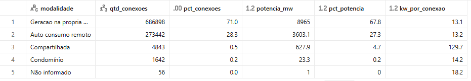

A geração na própria unidade consumidora tem 71% das conexões e 67,8% da
potência. O autoconsumo remoto tem 28,3%: quase um em cada três
empreendimentos gera em um local e usa os créditos em outro. A geração
compartilhada tem só 0,5% das conexões, mas 4,7% da potência, com cerca
de 130 kW por empreendimento, dez vezes o porte das outras modalidades. É
o modelo de consórcios e cooperativas que dividem os créditos de uma
usina maior. Condomínio é residual, e 56 registros estão sem modalidade.
A modalidade de múltiplas unidades consumidoras citada na pergunta
aparece na base com o nome "Condomínio".

### Pergunta 6: Quais fabricantes de módulos e inversores dominam o mercado?

```sql
-- 6a: módulos (6b igual, trocando sk_fabricante_modulo por sk_fabricante_inversor)
SELECT d.grupo_fabricante AS fabricante_modulo,
       COUNT(*) AS qtd_sistemas,
       ROUND(COUNT(*) * 100.0 / SUM(COUNT(*)) OVER (), 1) AS pct_sistemas
FROM mvp_mmgd.gold.f_tecnica_fv t
JOIN mvp_mmgd.gold.d_fabricante d ON t.sk_fabricante_modulo = d.sk_fabricante
GROUP BY d.grupo_fabricante
ORDER BY qtd_sistemas DESC
LIMIT 12
```

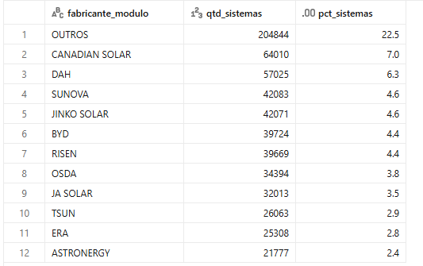
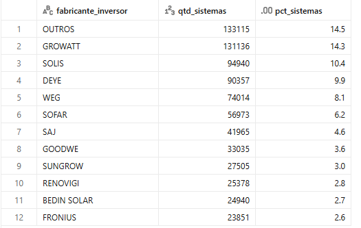

Os percentuais consideram apenas os sistemas com fabricante
informado. O mercado de módulos é pulverizado: nenhum fabricante
passa de 7%. Os maiores são Canadian Solar (7,0%), DAH (6,3%), Sunova e
Jinko Solar (4,6% cada), BYD e Risen (4,4% cada). Os cinco primeiros
somam cerca de 27%, e o grupo OUTROS fica com 22,5%. Chama atenção a
ausência da LONGi, uma das maiores fabricantes do mundo, que caiu em
OUTROS por ter o nome escrito de várias formas (ver Qualidade de Dados).

Nos inversores o mercado é mais concentrado: Growatt (14,3%), Solis
(10,4%), Deye (9,9%) e WEG (8,1%) somam 42,7%, e o OUTROS cai para 14,5%.
A WEG é a única marca brasileira entre os quatro primeiros. Nos dois
casos, pela fragmentação dos nomes, as participações dos grandes
fabricantes devem ser lidas como um valor mínimo.

### Pergunta 7: Qual o fator de dimensionamento médio dos sistemas fotovoltaicos?

```sql
SELECT COUNT(*) AS qtd_sistemas,
       ROUND(PERCENTILE(fator_dimensionamento, 0.5), 2) AS mediana,
       ROUND(AVG(fator_dimensionamento), 2) AS media,
       ROUND(PERCENTILE(fator_dimensionamento, 0.25), 2) AS p25,
       ROUND(PERCENTILE(fator_dimensionamento, 0.75), 2) AS p75
FROM mvp_mmgd.gold.f_tecnica_fv
WHERE fator_dimensionamento BETWEEN 0.5 AND 3.0
```

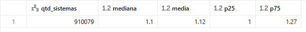

Considerando os 910.079 sistemas com fator entre 0,5 e 3,0,
a mediana é 1,10 e a média 1,12. Metade dos sistemas fica entre 1,00
e 1,27. Com o filtro, média e mediana ficaram praticamente iguais,
mostrando que a média de 2,09 da base completa era distorcida pelos
erros de cadastro.

Na prática, o sistema típico da região tem cerca de 10% mais potência em
módulos do que em inversor. É um sobredimensionamento conservador, usado
para compensar perdas por temperatura, sujeira e degradação dos módulos
sem gerar corte relevante de energia no inversor. Ficaram fora da faixa
56.441 sistemas (5,8%), que são erros de cadastro ou sistemas atípicos.

### Discussão geral

O problema era entender onde e para quem priorizar a expansão comercial
em geração distribuída, e quais escolhas técnicas marcam o mercado. As
respostas se complementam:

- **Onde:** o Paraná concentra mais da metade da potência da região, com
  destaque para o interior (Oeste e Norte), onde os sistemas são maiores.
  O Rio Grande do Sul é o mercado de maior volume de clientes, com
  sistemas pequenos. Quatro distribuidoras cobrem mais de 90% das
  conexões.
- **Para quem:** o residencial é a maior parte dos clientes, mas
  comercial, industrial e rural somam quase metade da potência com poucos
  clientes. O autoconsumo remoto (28%) e a geração compartilhada mostram
  espaço para projetos maiores fora do telhado do cliente.
- **Quando:** depois do pico de 2022, causado pela Lei 14.300, o mercado
  se estabilizou em torno de 1,8 GW por ano, com possível desaceleração
  em 2026.
- **Técnico:** o mercado de inversores é concentrado em poucas marcas
  (Growatt, Solis, Deye e WEG), o de módulos é pulverizado, e o projeto
  típico usa fator de dimensionamento em torno de 1,1.

---

## Autoavaliação

### Objetivos atingidos


### Dificuldades

- **Volume de dados:** a base nacional passa de 2 GB, o que ficou pesado
  para o Databricks Free Edition. A solução foi recortar para a Região Sul
  já na Bronze, o que também deixou as perguntas mais focadas.
- **Formato do CSV:** precisei testar a codificação (o ISO-8859-1 que
  imaginei no início corrompia os acentos, o correto era UTF-8) e tratar
  a vírgula decimal, que fazia as colunas numéricas serem lidas como texto.
- **Qualidade da origem:** colunas 100% nulas, data sentinela
  (1900-01-01), distribuidoras de outros estados em municípios do Sul e
  valores técnicos impossíveis. Cada caso exigiu investigar antes de
  decidir se corrigia, filtrava ou só documentava.
- **Nomes de fabricante:** foi o problema mais difícil. Com mais de 25 mil
  grafias diferentes, uma padronização completa não cabia no prazo, e a
  saída foi agrupar os 50 maiores e documentar a limitação.
- **Chaves das dimensões:** descobri que o `monotonically_increasing_id()`
  pode gerar valores diferentes a cada execução, o que me obrigou a gravar
  as dimensões antes de montar as fatos.

### Trabalhos futuros

- Padronizar os nomes de fabricante com comparação por similaridade de
  texto e separar os campos com mais de um fabricante.
- Fazer os cruzamentos que ficaram de fora, como estado × classe de
  consumo e modalidade × município.
- Ampliar o escopo para o Brasil inteiro, usando um ambiente com mais
  capacidade de processamento.
- Automatizar a carga com um Job agendado no Databricks, já que a ANEEL
  atualiza a base periodicamente.
- Montar um dashboard com as principais respostas e cruzar os dados com
  outras fontes, como tarifas de energia por distribuidora e irradiação
  solar por região.
